# Tela da Aplicação

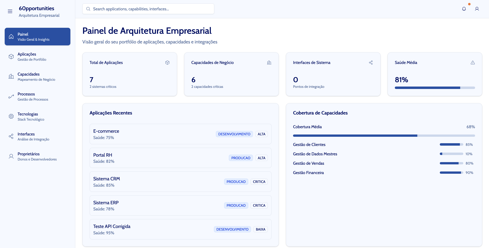{width="750" height="950" style="display: block; margin: 0 auto"}
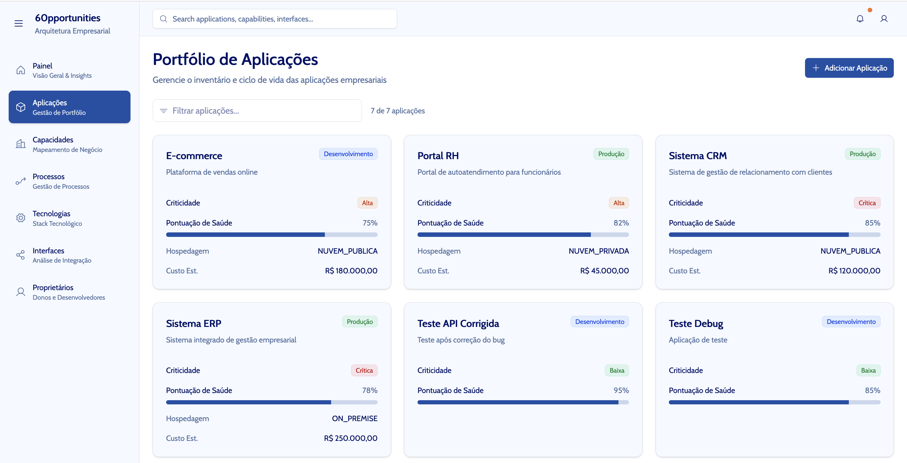{width="750" height="950" style="display: block; margin: 0 auto"}
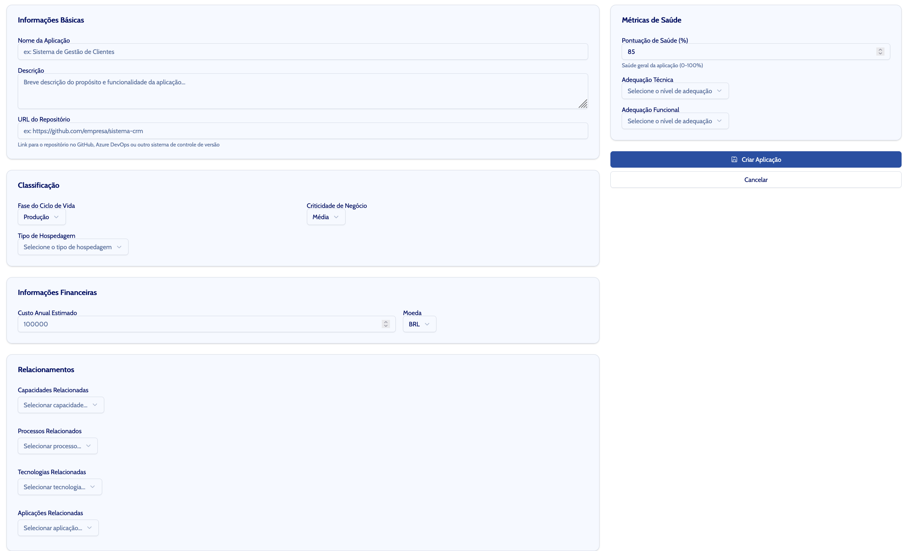{width="750" height="950" style="display: block; margin: 0 auto"}

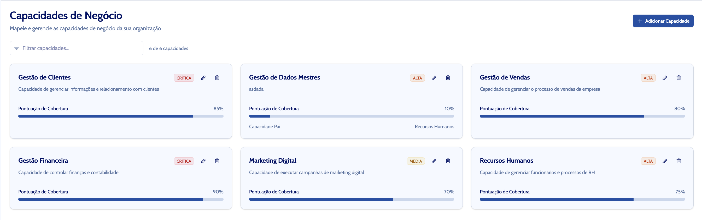{width="750" height="950" style="display: block; margin: 0 auto"}

{width="750" height="950" style="display: block; margin: 0 auto"}

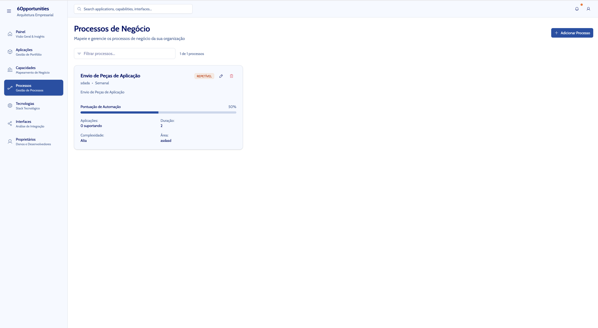{width="750" height="950" style="display: block; margin: 0 auto"}

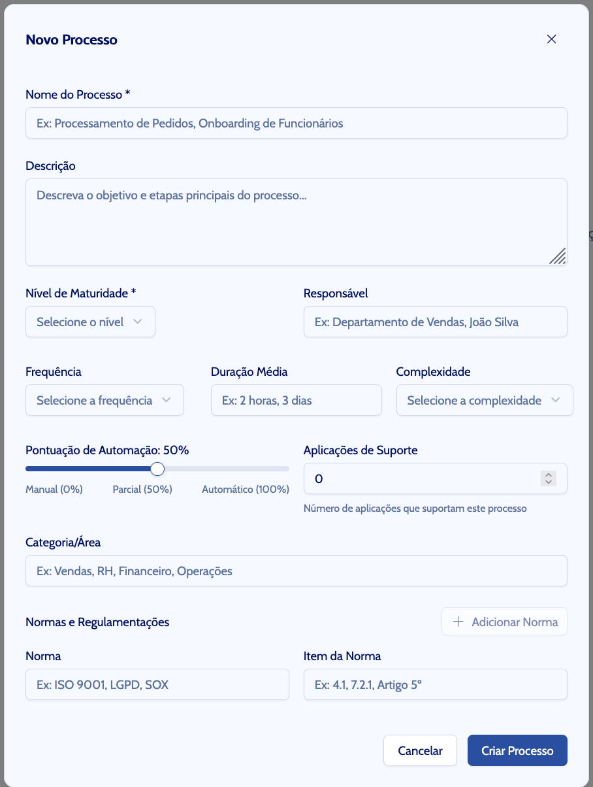{width="750" height="950" style="display: block; margin: 0 auto"}

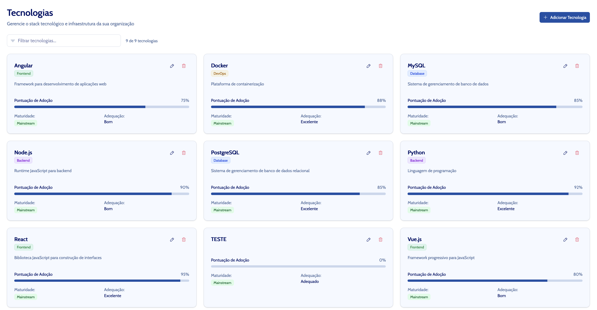{width="750" height="950" style="display: block; margin: 0 auto"}

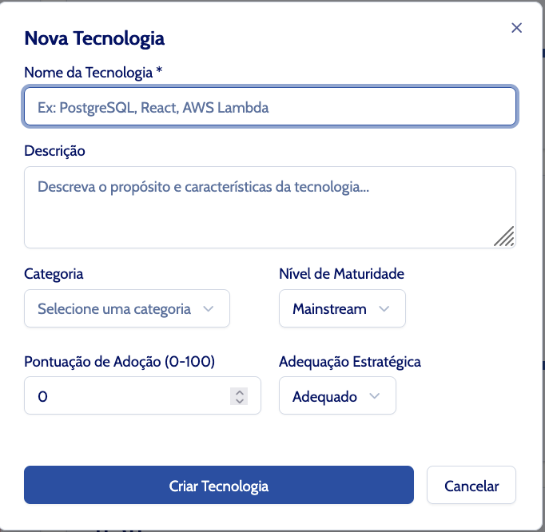{width="750" height="950" style="display: block; margin: 0 auto"}

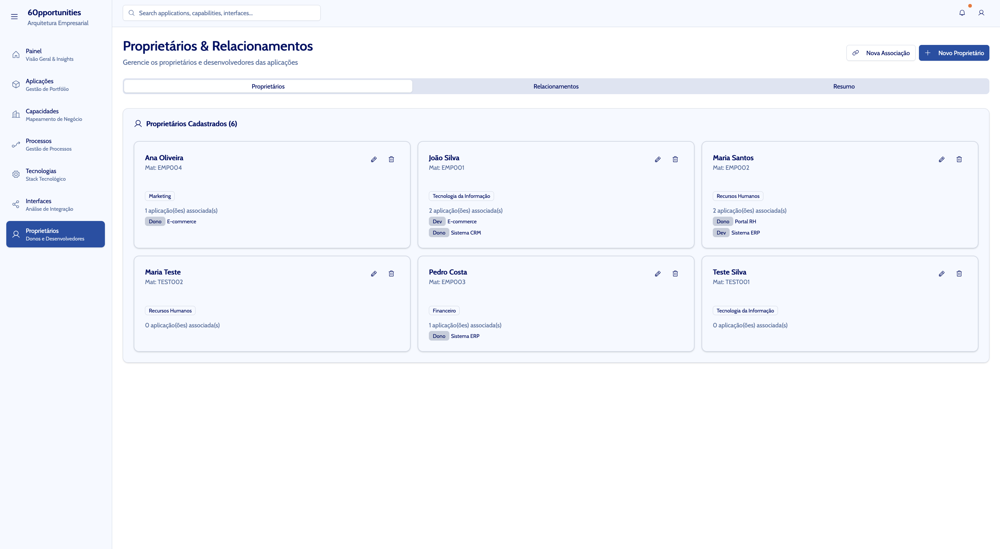{width="750" height="950" style="display: block; margin: 0 auto"}

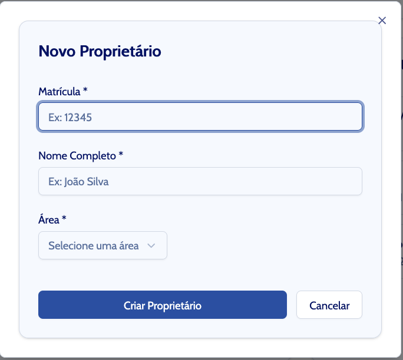{width="750" height="950" style="display: block; margin: 0 auto"}

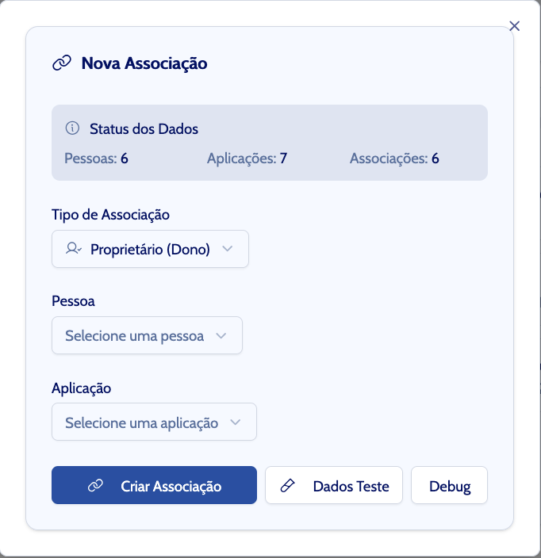{width="750" height="950" style="display: block; margin: 0 auto"}

- [x] rm -rf package-lock.json node_modules
- [x] npm install
- [x] npm run dev
- [x] npm install mysql2 dotenv express cors
- [x] npm install -D @types/express @types/cors
- [x] npm install -D tsx concurrently
- [x] npm install uuid && npm install -D @types/uuid

