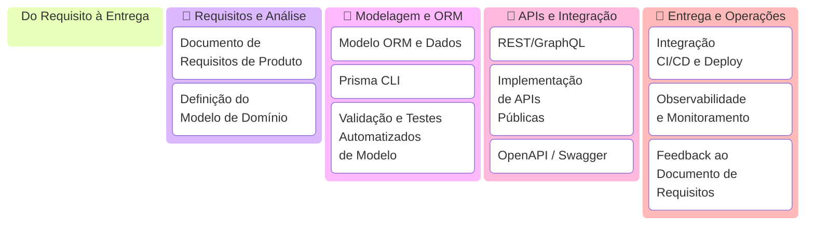
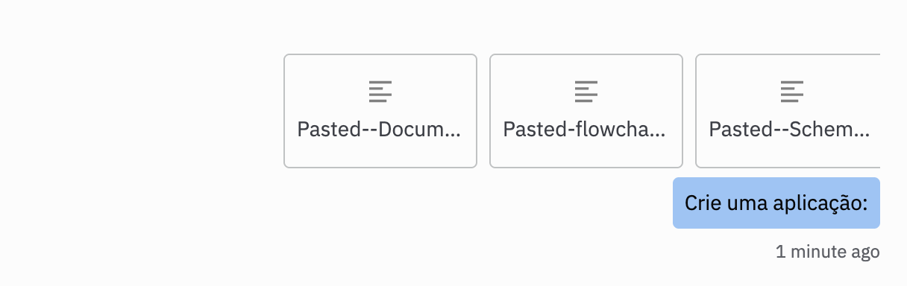
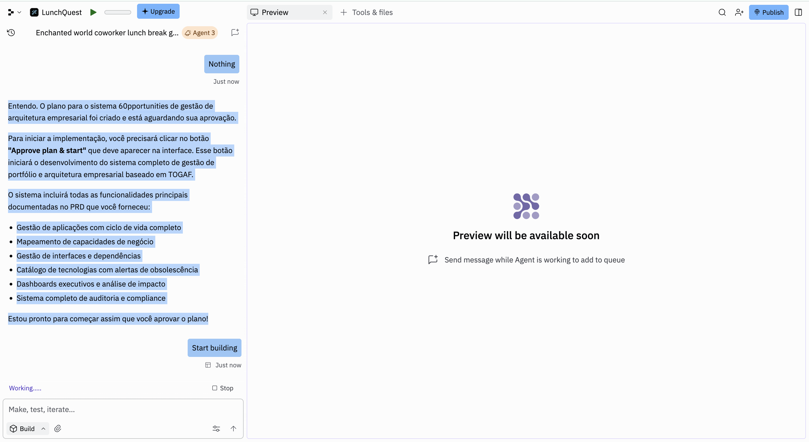
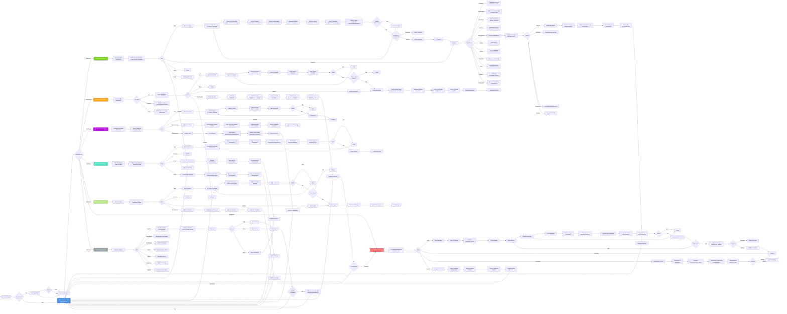

# Meu prompt
Você é um consultor de produtos de software especializado em TOGAF. 

Sua tarefa é criar um Documento de Requisitos de Produto (PRD) completo e pronto para uso, detalhando todas as funcionalidades, objetivos e restrições do sistema.

#### Requisitos do PRD:

- [x] **Visão Geral do Produto**: Objetivo, problema que resolve, público-alvo e stakeholders.
- [x] **Objetivos e Sucesso**: Metas de negócio, métricas de sucesso e critérios de aceitação.
- [x] **Requisitos Funcionais**: Funcionalidades detalhadas, casos de uso ou histórias de usuário.
- [x] **Requisitos Não Funcionais**: Desempenho, segurança, escalabilidade, usabilidade e compatibilidade.
- [x] **Fluxos e Cenários**: Sequência de ações do usuário e sistema, descrita de forma clara.
- [x] **Wireframes ou Mockups** (opcional).
- [x] **Restrições e Dependências**: Tecnológicas, legais ou de integração.
- [x] **Roadmap e Priorização:** Funcionalidades prioritárias e cronograma sugerido.

**Contexto**: O sistema 60pportunities, é uma ferramenta de gestão de portfólio e arquitetura que apoia empresas na implementação prática de uma arquitetura empresarial. Permitindo mapear aplicações, processos, dados e tecnologias, documentando suas relações, dependências e ciclo de vida.
Deverá funcionar como catalisador do TOGAF, oferecendo suporte para:

- [x] Inventário de aplicações e tecnologias;
- [x] Conexão entre capacidades de negócio e sistemas (Business Capability Mapping);
- [x] Gestão de riscos tecnológicos e obsolescência;
- [x] Roadmaps de transformação alinhados à estratégia de negócio;

Deverá ser observado:

- [x] Arquitetura de Aplicações --> Application Portfolio Management (APM): Inventário de sistemas, ciclos de vida, custos, criticidade;
- [x] Arquitetura de Dados --> Conexão de dados com sistemas e fluxos de integração, análise de dependências;
- [x] Arquitetura de Tecnologia --> Gestão de infraestrutura, tecnologias e riscos (TRM)
- [x] ADM (ciclo de desenvolvimento) --> Roadmaps de transformação, análise de cenários e tomada de decisão baseada em dados

#### ORM (Object-Relational Mapping, ou Mapeamento Objeto-Relacional)
Após a Architecture Decision Record (ADR), abaixo decidiu-se pela utilização do ORM - PRISMA.

##### ADR 001 — Escolha do ORM (Object-Relational Mapping)

**Status:** Aprovado
**Data:** 08/10/2025
**Autor:** [Equipe de Arquitetura / Núcleo de Desenvolvimento]
**Decisão:** Adoção do **Prisma ORM** como padrão corporativo para novos serviços.

###### Contexto
O projeto requer uma camada de persistência de dados robusta, segura e produtiva, com integração fluida aos pipelines DevSecOps e compatibilidade com múltiplos bancos relacionais (PostgreSQL, MySQL, SQL Server, SQLite, etc.). Os serviços são majoritariamente desenvolvidos em **Node.js/TypeScript**, com demandas de:

- [X] Mapeamento tipado e seguro entre objetos e tabelas.
- [X] Geração automática de esquemas e migrações.
- [X] Integração com ferramentas de documentação e testes automatizados.
- [X] Suporte a arquitetura **clean** e princípios de **Domain-Driven Design (DDD)**.

###### Alternativas Avaliadas

| Critério                     | **Prisma**                                      | **TypeORM**                                | **SQLAlchemy**                                |
| ---------------------------- | ----------------------------------------------- | ------------------------------------------ | --------------------------------------------- |
| **Linguagem**                | TypeScript / Node.js                            | TypeScript / Node.js                       | Python                                        |
| **Abordagem**                | *Schema-first* (modelo declarativo)             | *Decorator-based* (modelo imperativo)      | *Declarative ORM* (via classes Python)        |
| **Maturidade e Comunidade**  | Alta e crescente                                | Alta, porém em desaceleração               | Muito alta (maduro, mas em outro ecossistema) |
| **Performance**              | Alta (query engine em Rust)                     | Moderada (JS puro)                         | Alta                                          |
| **Type Safety**              | Forte (tipagem gerada a partir do schema)       | Limitada (baseada em decorators e runtime) | Forte (via mypy e pydantic)                   |
| **Migrações**                | Automatizadas e consistentes                    | Menos previsíveis                          | Sólidas (Alembic)                             |
| **Produtividade**            | Alta (autocompletar, validações em build time)  | Média (configuração manual extensa)        | Alta (no ecossistema Python)                  |
| **Integração com DevSecOps** | Excelente (scripts automatizáveis, CI/CD ready) | Boa (requere setup adicional)              | Boa (limitada ao stack Python)                |
| **Curva de Aprendizado**     | Curta                                           | Média                                      | Média                                         |
| **Suporte Multi-banco**      | Sim                                             | Sim                                        | Sim                                           |

###### Análise Detalhada
####### **Prisma**
- [X] **Forças:**
    - [X] Engine de consultas em **Rust**, garantindo alto desempenho.
    - [X] Geração automática de **tipos TypeScript**, eliminando classes manuais.
    - [X] Ferramentas integradas (`prisma migrate`, `prisma studio`) facilitam CI/CD e observabilidade.
    - [X] Excelente compatibilidade com **GraphQL**, **REST**, **NestJS** e **Next.js**.
    - [X] Facilita o princípio **"Clean Core"** — a lógica de domínio não depende do ORM.
- [X] **Fraquezas:**
    - [X] Foco exclusivo em TypeScript (não suporta Python/Java).
    - [X] Menor controle manual sobre SQL bruto (embora possível via `queryRaw`).
####### **TypeORM**
- [X] **Forças:**
    - [X] Baseado em **decorators** familiares a quem usa NestJS.
    - [X] Amplo suporte a bancos e features como lazy loading.
- [X] **Fraquezas:**
    - [X] Problemas de **consistência de migrações** e **sincronização de schema**.
    - [X] Menor performance e **tipagem fraca** (muitas validações ocorrem em runtime).
    - [X] Menor previsibilidade em ambientes com CI/CD automatizado.
####### **SQLAlchemy**
- [X] **Forças:**
    - [X] ORM mais maduro do mercado.
    - [X] Extensível, sólido e com controle total sobre SQL.
    - [X] Integração perfeita com frameworks Python (FastAPI, Flask, Django).
- [X] **Fraquezas:**
    - [X] Requer adoção do stack Python.
    - [X] Menos alinhado com o ecossistema TypeScript e com práticas de tipagem forte no front/back.
###### Decisão
Após análise técnica e estratégica, decidiu-se pela **adoção do Prisma ORM** como padrão para novos serviços baseados em Node.js/TypeScript. A decisão se fundamenta nos seguintes pontos:

- [x] **Produtividade:** O Prisma simplifica o ciclo de desenvolvimento e manutenção.
- [x] **Segurança e qualidade:** Geração de tipos e validações em tempo de build reduzem erros em runtime.
- [x] **DevSecOps:** O modelo declarativo e CLI integrada facilitam integração com pipelines automatizados.
- [x] **Clean Architecture:** Separa domínio e persistência de forma clara, evitando acoplamentos desnecessários.
- [x] **Performance:** Query engine em Rust proporciona ganhos reais de performance e estabilidade.

###### Consequências
####### **Positivas**
- [x] Aumento da produtividade dos times.
- [x] Redução de bugs relacionados a inconsistências de schema.
- [x] Melhoria na integração contínua e automação de deploys.
- [x] Maior aderência à cultura **Clean Core** e **Documentation as Code**.

####### **Negativas**
- [x] Necessidade de treinamento inicial em Prisma CLI e modelagem declarativa.
- [x] Dependência direta do ecossistema Node.js/TypeScript.

###### Plano de Ação
- [x] Criar repositório de referência com **boilerplate Prisma + NestJS + PostgreSQL**.
- [x] Atualizar guidelines de desenvolvimento no repositório `dev-standards`.
- [x] Realizar workshop interno sobre **Prisma ORM** e boas práticas de migração.
- [x] Definir padrões de auditoria e logging a partir do Prisma Client.

###### Referências
- [x] [Prisma ORM Documentation](https://www.prisma.io/docs)
- [x] [TypeORM Documentation](https://typeorm.io)
- [x] [SQLAlchemy Documentation](https://www.sqlalchemy.org)
- [x] [Node.js Clean Architecture Principles](https://khalilstemmler.com/articles/enterprise-typescript-nodejs/clean-architecture/)

**Decisão Final:**
> O Prisma ORM é adotado como o ORM oficial para projetos em Node.js/TypeScript, substituindo o uso de TypeORM em novos desenvolvimentos.

#### Modelo Aplicado
<div class="center-table" markdown>

</div>

#### Formato da Resposta
- [x] Use títulos e subtítulos claros seguindo a estrutura acima;
- [x] Utilize listas numeradas ou tabelas quando necessário;
- [x] Linguagem natural, direta, sem abreviações ou jargões;
- [x] Documento pronto para ser usado por equipes técnicas e stakeholders;
- [x] Crie um schema de ORM-Prisma para este projeto - togaf-enterprise-arc;
- [x] Elabore um fluxograma em Mermaid, considerando todos os detalhes de UX, que o usuário terá na Aplicação.

#### Estimamos o mínimo de Informações necessárias
Uma aplicação poderá possuir várias tecnologias embarcadas, inúmeras Business Capability, interfaces, Processos e os Owners deverá ser temporais. 
Aplicações, Business Capability, Interfaces,  Processos poderão ter mais de uma Tags/Labels.


##### Aplicações
- Application ID
- Application Name
- Business Capability
- Business Process
- IT Owner
- Business Owner
- Lifecycle Phase
- Criticality
- Hosting Type
- Provider/Vendor
- Technology Stack
- Interfaces (To/From)
- Data Objects
- Region/Location
- Compliance
- Costs (Estimated)
- Technical Fit
- Functional Fit
- Tags/Labels
- Dependencies
- Comments/Notes

##### Business Capability
- ID
- Nome
- Parent
- Descrição
- Criticidade
- Owner
- Tags/Labels
- Start-Date
- End-Date

##### Interface
- Interface ID
- Source Application
- Target Application
- Type
- Frequency
- Protocol
- Data Objects
- Comments
- Start-Date
- End-Date
- 
##### Processos
- Process ID
- Process Name
- Description
- Business Owner
- Applications Involved
- Region/Location
- Tags/Labels
- Compliance
- Comments
- Start-Date
- End-Date
- 
##### Tecnologias
- Technology ID
- Technology Name
- Category
- Vendor
- Version
- Lifecycle Phase
- Comments
- Tags/Labels
- Start-Date
- End-Date

#### Owner
- Owner ID
- Business Owner
- Start-Date
- End-Date

#### Tags/Labels
- Tag ID
- Nome da Tag/Label
- Cor (A cor deverá ser em HTML)

## Criação da Estrutura de Banco de Dados - PRISMA

```markdown
~ via 🐍 v3.12.7
❯ npx prisma@latest init --db
Need to install the following packages:
prisma@6.17.0
Ok to proceed? (y) y

Fetching latest updates for this subcommand...
This will create a project for you on console.prisma.io and requires you to be authenticated.
✔ Would you like to authenticate? Yes
✔ Select an authentication method Google
Authenticating to Prisma Platform via browser.

Visit the following URL in your browser to authenticate:
https://console.prisma.io/auth/cli?state=eyJjbGllbnQiOiJwcmlzbWEtY2xpLWluaXQvMC40LjEgKFNpZ25hdHVyZTogNmY3NTg0MWUtYWRhYi00OWY1LWEyYjktY2YwNjg3ZDRmOTE2KSIsImNvbm5lY3Rpb24iOiJnb29nbGUiLCJyZWRpcmVjdFRvIjoiaHR0cDovLzEyNy4wLjAuMTo1MTk0Ni8ifQ%3D%3D
Successfully authenticated as horacio.vasconcellos@gmail.com.
Let's set up your Prisma Postgres database!
✔ Select your region: us-east-1 - US East (N. Virginia)
✔ Enter a project name: togaf-enterprise-arc
✔ Success! Your Prisma Postgres database is ready ✅

We created an initial schema.prisma file and a .env file with your DATABASE_URL environment variable already set.

--- Next steps ---

Go to https://pris.ly/ppg-init for detailed instructions.

1. Define your database schema
Open the schema.prisma file and define your first models. Check the docs if you need inspiration: https://pris.ly/ppg-init.

2. Apply migrations
Run the following command to create and apply a migration:
npx prisma migrate dev --name init

3. Manage your data
View and edit your data locally by running this command:
npx prisma studio

...or online in Console:
https://console.prisma.io/cmgi12w4w0952zhfh19ng1bv5/cmgi14yd205uk00d05fotbqhr/cmgi14yd305ul00d04nyrz4od/studio

4. Send queries from your app
To access your database from a JavaScript/TypeScript app, you need to use Prisma ORM. Go here for step-by-step instructions: https://pris.ly/ppg-init


~ via 🐍 v3.12.7 took 2m27s
❯
```

# Documento de Requisitos de Produto (PRD)
## 60pportunities - Sistema de Gestão de Arquitetura Empresarial

**Versão:** 1.0  
**Data:** 08 de Outubro de 2025  
**Autor:** Equipe de Arquitetura Empresarial  
**Status:** Aprovado para Desenvolvimento

---

## 1. Visão Geral do Produto

### 1.1 Objetivo

O 60pportunities é uma plataforma de gestão de portfólio e arquitetura empresarial que capacita organizações a implementar e operacionalizar o framework TOGAF de forma prática e eficiente. O sistema oferece visibilidade completa sobre aplicações, processos, dados, tecnologias e suas interdependências, permitindo decisões estratégicas baseadas em dados concretos.

### 1.2 Problema que Resolve

As organizações enfrentam desafios significativos na gestão de sua arquitetura empresarial:

- Falta de visibilidade sobre o portfólio de aplicações e suas interdependências
- Dificuldade em conectar capacidades de negócio com sistemas tecnológicos
- Riscos não mapeados relacionados a obsolescência tecnológica
- Ausência de roadmaps de transformação alinhados à estratégia
- Documentação dispersa e desatualizada de arquitetura
- Dificuldade em avaliar impactos de mudanças tecnológicas
- Custos ocultos e redundâncias não identificadas

### 1.3 Público-Alvo

**Usuários Primários:**
- Arquitetos Empresariais
- Arquitetos de Soluções
- Gerentes de Portfólio de Aplicações
- CTOs e CIOs

**Usuários Secundários:**
- Product Owners
- Gerentes de Projeto
- Analistas de Negócio
- Gestores de TI

**Stakeholders:**
- Diretoria Executiva
- Gestores de Negócio
- Equipes de Compliance
- Auditoria Interna
- Fornecedores e Vendors

### 1.4 Proposta de Valor

- **Visibilidade Total:** Inventário completo de aplicações, tecnologias e processos em uma única plataforma
- **Decisões Informadas:** Análise de dependências e impactos para tomada de decisão estratégica
- **Gestão de Riscos:** Identificação proativa de obsolescência e vulnerabilidades tecnológicas
- **Alinhamento Estratégico:** Conexão clara entre capacidades de negócio e sistemas de TI
- **Roadmaps Inteligentes:** Planejamento de transformação baseado em dados reais
- **Redução de Custos:** Identificação de redundâncias e otimização de investimentos

---

## 2. Objetivos e Critérios de Sucesso

### 2.1 Objetivos de Negócio

**Curto Prazo (0-6 meses):**
- Cadastrar e catalogar 100% do portfólio de aplicações críticas
- Mapear as principais capacidades de negócio e suas relações com sistemas
- Identificar tecnologias em fase de obsolescência

**Médio Prazo (6-12 meses):**
- Estabelecer governança ativa sobre o portfólio de aplicações
- Reduzir custos operacionais em 15% através da identificação de redundâncias
- Implementar roadmaps de transformação digital alinhados à estratégia

**Longo Prazo (12-24 meses):**
- Tornar-se a fonte única de verdade para arquitetura empresarial
- Reduzir o tempo de análise de impacto de mudanças em 50%
- Atingir maturidade nível 4 em práticas de arquitetura empresarial

### 2.2 Métricas de Sucesso (KPIs)

**Adoção:**
- Taxa de cadastro de aplicações: 90% em 3 meses
- Número de usuários ativos mensais: crescimento de 20% ao mês
- Taxa de atualização de dados: mínimo semanal por aplicação crítica

**Qualidade de Dados:**
- Completude de informações: 95% dos campos obrigatórios preenchidos
- Dados desatualizados: menos de 5% com mais de 30 dias sem atualização
- Interfaces mapeadas: 100% das integrações críticas documentadas

**Valor de Negócio:**
- Tempo médio de análise de impacto: redução de 5 dias para 2 horas
- Identificação de redundâncias: pelo menos 10 aplicações candidatas a consolidação
- ROI documentado: economia de custos de pelo menos 20% do investimento

**Satisfação:**
- NPS (Net Promoter Score): acima de 50
- Taxa de resolução de problemas: 90% em até 48 horas
- Avaliação de usabilidade: média 4.5/5.0

### 2.3 Critérios de Aceitação

**Funcionalidade:**
- Sistema permite cadastro completo de aplicações com todos os atributos definidos
- Mapeamento bidirecional entre capacidades de negócio e aplicações funciona corretamente
- Análise de dependências gera grafos visuais navegáveis
- Exportação de relatórios em múltiplos formatos (PDF, Excel, JSON)

**Performance:**
- Tempo de carregamento de dashboards: menor que 2 segundos
- Consultas complexas de dependências: resultado em menos de 5 segundos
- Suporte a pelo menos 1000 aplicações sem degradação de performance

**Segurança:**
- Autenticação multifator implementada
- Controle de acesso baseado em papéis (RBAC) funcional
- Auditoria completa de todas as operações críticas
- Conformidade com LGPD e GDPR

---

## 3. Requisitos Funcionais

### 3.1 Gestão de Aplicações (Application Portfolio Management)

**RF001 - Cadastro de Aplicações**
- O sistema deve permitir o cadastro completo de aplicações com todos os atributos definidos
- Deve ser possível associar múltiplas tecnologias a uma aplicação
- O sistema deve validar dados obrigatórios antes de salvar
- Deve permitir upload de documentação anexa (diagramas, manuais)

**RF002 - Ciclo de Vida de Aplicações**
- Gerenciar fases do ciclo de vida: Planejamento, Desenvolvimento, Produção, Manutenção, Descontinuação
- Alertas automáticos para aplicações em fase de descontinuação
- Histórico completo de mudanças de fase
- Dashboard de distribuição de aplicações por fase

**RF003 - Análise de Custos**
- Registro de custos por aplicação (licenças, infraestrutura, manutenção)
- Cálculo de TCO (Total Cost of Ownership)
- Comparação de custos entre aplicações similares
- Projeção de custos para roadmaps de transformação

**RF004 - Avaliação de Fit**
- Avaliação de aderência técnica (Technical Fit) em escala de 1-5
- Avaliação de aderência funcional (Functional Fit) em escala de 1-5
- Cálculo automático de score de saúde da aplicação
- Recomendações de ações baseadas em scores baixos

### 3.2 Business Capability Mapping

**RF005 - Gestão de Capacidades de Negócio**
- Cadastro hierárquico de capacidades (parent/child)
- Associação de múltiplas aplicações a uma capacidade
- Definição de criticidade por capacidade
- Visualização em mapa de calor de capacidades

**RF006 - Mapeamento Capacidade-Aplicação**
- Relacionamento bidirecional entre capacidades e aplicações
- Identificação de capacidades não suportadas por sistemas
- Identificação de aplicações sem capacidade associada
- Análise de cobertura de capacidades

**RF007 - Análise de Gaps**
- Identificação de capacidades críticas sem suporte adequado
- Comparação entre estado atual (AS-IS) e desejado (TO-BE)
- Priorização de investimentos baseada em gaps críticos
- Exportação de relatórios de gap analysis

### 3.3 Gestão de Interfaces e Integrações

**RF008 - Cadastro de Interfaces**
- Registro de interfaces ponto-a-ponto entre aplicações
- Especificação de tipo, protocolo, frequência e objetos de dados
- Definição de período de vigência (start/end date)
- Documentação de SLAs e requisitos não funcionais

**RF009 - Mapa de Integrações**
- Visualização gráfica de todas as interfaces (grafo direcionado)
- Filtros por aplicação, tipo, protocolo
- Identificação de pontos únicos de falha (single points of failure)
- Análise de complexidade de integrações

**RF010 - Análise de Impacto**
- Cálculo de impacto downstream quando uma aplicação é alterada
- Cálculo de impacto upstream de dependências
- Simulação de cenários "what-if"
- Geração de planos de comunicação para mudanças

### 3.4 Gestão de Processos de Negócio

**RF011 - Cadastro de Processos**
- Documentação completa de processos de negócio
- Associação de processos com aplicações que os suportam
- Definição de conformidades regulatórias por processo
- Versionamento de processos

**RF012 - Process-Application Mapping**
- Mapeamento de quais aplicações suportam cada processo
- Identificação de processos manuais candidatos a automação
- Análise de redundância de processos
- Priorização de otimização de processos

### 3.5 Gestão de Tecnologias (TRM - Technology Reference Model)

**RF013 - Catálogo de Tecnologias**
- Inventário completo de tecnologias em uso
- Categorização (linguagens, frameworks, bancos de dados, etc.)
- Tracking de versões e vendor
- Status do ciclo de vida tecnológico

**RF014 - Gestão de Obsolescência**
- Alertas de tecnologias chegando ao fim do suporte
- Identificação de aplicações usando tecnologias obsoletas
- Planejamento de migração tecnológica
- Dashboard de riscos tecnológicos

**RF015 - Padronização Tecnológica**
- Definição de tecnologias aprovadas, toleradas e proibidas
- Análise de conformidade com padrões corporativos
- Roadmap de consolidação tecnológica
- Métricas de diversidade tecnológica

### 3.6 Roadmaps de Transformação (ADM)

**RF016 - Criação de Roadmaps**
- Planejamento de iniciativas de transformação em timeline
- Associação de aplicações, tecnologias e capacidades aos roadmaps
- Definição de marcos e dependências entre iniciativas
- Tracking de progresso de implementação

**RF017 - Análise de Cenários**
- Comparação de múltiplos cenários de transformação
- Análise de custos, riscos e benefícios por cenário
- Simulação de impactos em capacidades de negócio
- Recomendação de melhor cenário baseado em critérios

**RF018 - Dashboard Executivo**
- Visão consolidada do portfólio de aplicações
- Indicadores-chave de saúde da arquitetura
- Status de roadmaps em andamento
- Alertas e ações requeridas

### 3.7 Gestão de Dados e Compliance

**RF019 - Data Objects Management**
- Cadastro de objetos de dados trafegados entre sistemas
- Classificação de sensibilidade de dados (público, interno, confidencial, restrito)
- Mapeamento de fluxos de dados
- Identificação de dados sujeitos a regulamentações

**RF020 - Compliance e Auditoria**
- Registro de requisitos de compliance por aplicação/processo
- Tracking de conformidade com LGPD, GDPR, SOX, etc.
- Histórico completo de mudanças (audit trail)
- Relatórios de conformidade para auditoria

### 3.8 Gestão de Stakeholders

**RF021 - Cadastro de Owners**
- Registro de IT Owners e Business Owners
- Definição temporal de responsabilidades (start/end date)
- Histórico de mudanças de ownership
- Notificações automáticas para owners sobre mudanças relevantes

**RF022 - Sistema de Tags/Labels**
- Criação e gestão de tags customizáveis
- Aplicação de múltiplas tags a entidades
- Definição de cores para identificação visual
- Filtros e buscas baseadas em tags

### 3.9 Colaboração e Workflows

**RF023 - Comentários e Anotações**
- Sistema de comentários em todas as entidades
- Menções a usuários (@mention)
- Histórico de discussões
- Notificações de novas interações

**RF024 - Aprovações e Workflows**
- Fluxo de aprovação para mudanças críticas
- Notificações para aprovadores
- Histórico de aprovações
- Configuração de workflows customizados

### 3.10 Relatórios e Exportações

**RF025 - Relatórios Padrão**
- Relatório de portfólio de aplicações
- Relatório de mapeamento de capacidades
- Relatório de análise de tecnologias
- Relatório de interfaces e dependências

**RF026 - Exportações**
- Exportação em Excel, PDF, JSON
- Exportação de grafos em imagem (PNG, SVG)
- API para integração com ferramentas externas
- Agendamento de relatórios recorrentes

---

## 4. Requisitos Não Funcionais

### 4.1 Performance

**RNF001 - Tempo de Resposta**
- Carregamento de páginas: menor que 2 segundos em 95% dos casos
- Consultas simples: menor que 1 segundo
- Consultas complexas (análise de dependências): menor que 5 segundos
- Geração de relatórios: menor que 10 segundos para 1000 registros

**RNF002 - Escalabilidade**
- Suportar até 5000 aplicações cadastradas
- Suportar até 50000 interfaces mapeadas
- Suportar até 200 usuários simultâneos sem degradação
- Crescimento horizontal através de containers

**RNF003 - Disponibilidade**
- SLA de 99.5% de uptime (máximo 3.65 horas de indisponibilidade mensal)
- Backup automático diário com retenção de 30 dias
- Recuperação de desastres (RTO: 4 horas, RPO: 1 hora)
- Manutenções programadas em janelas de baixo uso

### 4.2 Segurança

**RNF004 - Autenticação e Autorização**
- Autenticação via SSO (SAML 2.0, OAuth 2.0)
- Suporte a autenticação multifator (MFA)
- Controle de acesso baseado em papéis (RBAC)
- Política de senhas forte (mínimo 12 caracteres, complexidade)

**RNF005 - Proteção de Dados**
- Criptografia em trânsito (TLS 1.3)
- Criptografia em repouso (AES-256)
- Anonimização de dados sensíveis em logs
- Conformidade com LGPD e GDPR

**RNF006 - Auditoria**
- Log de todas operações de criação, edição e exclusão
- Registro de acessos e tentativas de acesso
- Retenção de logs por 2 anos
- Alertas de atividades suspeitas

### 4.3 Usabilidade

**RNF007 - Interface**
- Design responsivo (desktop, tablet)
- Suporte a navegadores modernos (Chrome, Firefox, Edge, Safari)
- Tema claro e escuro
- Acessibilidade WCAG 2.1 nível AA

**RNF008 - Experiência do Usuário**
- Onboarding guiado para novos usuários
- Help contextual em todas as telas
- Atalhos de teclado para operações frequentes
- Feedback visual de ações (loading, sucesso, erro)

**RNF009 - Internacionalização**
- Suporte inicial em português brasileiro
- Preparação para inglês e espanhol
- Formato de datas e números localizados
- Timezone configurável por usuário

### 4.4 Manutenibilidade

**RNF010 - Arquitetura**
- Arquitetura limpa (Clean Architecture)
- Separação clara entre camadas (apresentação, domínio, infraestrutura)
- Princípios SOLID aplicados
- Documentação técnica atualizada

**RNF011 - Código**
- Cobertura de testes unitários: mínimo 80%
- Testes de integração para fluxos críticos
- Análise estática de código (linting, code smells)
- Code review obrigatório para todas as mudanças

**RNF012 - DevSecOps**
- Pipeline CI/CD automatizado
- Testes automatizados em todos os stages
- Análise de vulnerabilidades (SAST, DAST)
- Deploy automatizado em múltiplos ambientes

### 4.5 Compatibilidade e Integrações

**RNF013 - Integrações**
- API REST documentada (OpenAPI 3.0)
- Webhooks para notificações de eventos
- Importação de dados via CSV/Excel
- Integração com ferramentas de colaboração (Slack, Teams)

**RNF014 - Infraestrutura**
- Containerização via Docker
- Orquestração via Kubernetes
- Banco de dados relacional (PostgreSQL 14+)
- Cache distribuído (Redis)

---

## 5. Fluxos e Cenários de Uso

### 5.1 Fluxo Principal: Cadastro e Análise de Aplicação

**Ator:** Arquiteto Empresarial

**Pré-condições:** Usuário autenticado com permissões de edição

**Fluxo Normal:**
1. Usuário acessa menu "Aplicações" e clica em "Nova Aplicação"
2. Sistema exibe formulário de cadastro com campos obrigatórios destacados
3. Usuário preenche informações básicas (nome, descrição, owner)
4. Usuário seleciona capacidades de negócio relacionadas
5. Usuário adiciona tecnologias utilizadas pela aplicação
6. Usuário define fase do ciclo de vida e criticidade
7. Usuário registra custos estimados e tipo de hosting
8. Usuário adiciona tags para categorização
9. Usuário salva a aplicação
10. Sistema valida dados e persiste no banco
11. Sistema exibe mensagem de sucesso e redireciona para página de detalhes
12. Usuário visualiza dashboard da aplicação com métricas e relacionamentos

**Fluxos Alternativos:**
- FA1: Se dados obrigatórios não forem preenchidos, sistema exibe erros de validação
- FA2: Se aplicação com mesmo nome já existir, sistema sugere edição ou criação com nome diferente
- FA3: Usuário pode salvar como rascunho para completar depois

### 5.2 Fluxo: Análise de Impacto de Mudança

**Ator:** Arquiteto de Soluções

**Cenário:** Avaliar impacto de descontinuar uma aplicação

**Fluxo Normal:**
1. Usuário busca a aplicação a ser descontinuada
2. Usuário acessa aba "Análise de Impacto"
3. Sistema calcula e exibe todas as dependências downstream
4. Sistema identifica aplicações que dependem diretamente
5. Sistema identifica processos de negócio afetados
6. Sistema identifica capacidades que perderão suporte
7. Sistema gera score de risco do impacto
8. Usuário visualiza grafo interativo de dependências
9. Usuário pode simular cenário alternativo substituindo aplicação
10. Sistema recalcula impacto com nova aplicação
11. Usuário exporta relatório de análise de impacto em PDF

### 5.3 Fluxo: Mapeamento de Capacidade de Negócio

**Ator:** Business Architect

**Fluxo Normal:**
1. Usuário acessa "Capacidades de Negócio"
2. Usuário cria nova capacidade definindo nome e descrição
3. Usuário define capacidade pai para criar hierarquia
4. Usuário define criticidade (baixa, média, alta, crítica)
5. Usuário associa Business Owner
6. Usuário busca e vincula aplicações que suportam a capacidade
7. Sistema calcula score de cobertura da capacidade
8. Usuário adiciona tags para categorização
9. Sistema persiste mapeamento
10. Usuário visualiza mapa de calor de capacidades
11. Sistema destaca capacidades críticas sem suporte adequado

### 5.4 Fluxo: Criação de Roadmap de Transformação

**Ator:** CTO / Arquiteto Empresarial

**Fluxo Normal:**
1. Usuário acessa "Roadmaps" e cria novo roadmap
2. Usuário define nome, objetivo e timeline (trimestres/anos)
3. Usuário adiciona iniciativas no roadmap
4. Para cada iniciativa, usuário define:
   - Aplicações envolvidas
   - Tecnologias a serem adotadas/descontinuadas
   - Capacidades de negócio impactadas
   - Dependências entre iniciativas
   - Custos estimados
   - Benefícios esperados
5. Sistema valida dependências e alerta sobre conflitos
6. Sistema calcula esforço total e ROI estimado
7. Usuário pode comparar múltiplos cenários de roadmap
8. Sistema recomenda melhor cenário baseado em critérios definidos
9. Usuário aprova roadmap e publica para stakeholders
10. Sistema envia notificações para todos os envolvidos

### 5.5 Fluxo: Identificação de Obsolescência Tecnológica

**Ator:** Technology Risk Manager

**Fluxo Normal:**
1. Usuário acessa dashboard de "Gestão de Tecnologias"
2. Sistema exibe alertas de tecnologias próximas ao fim de suporte
3. Usuário filtra por tecnologias em fase de descontinuação
4. Sistema lista todas as aplicações usando essas tecnologias
5. Para cada tecnologia, usuário visualiza:
   - Data de fim de suporte do vendor
   - Número de aplicações impactadas
   - Criticidade das aplicações
   - Alternativas tecnológicas recomendadas
6. Usuário cria iniciativa de migração tecnológica
7. Sistema sugere ordem de migração baseada em criticidade
8. Usuário adiciona iniciativa ao roadmap de transformação
9. Sistema calcula custos e prazos de migração
10. Usuário exporta relatório executivo de riscos tecnológicos

---

## 6. Arquitetura de Dados (Schema Prisma)

O schema completo do banco de dados está disponível em artifact separado para facilitar implementação e manutenção.

---

## 7. Restrições e Dependências

### 7.1 Restrições Técnicas

**Tecnológicas:**
- Stack obrigatória: Node.js 20+, TypeScript 5+, Prisma ORM
- Banco de dados: PostgreSQL 14 ou superior
- Frontend: React 18+ com TypeScript
- Infraestrutura: Kubernetes 1.25+

**Legais e Regulatórias:**
- Conformidade com LGPD para dados de clientes brasileiros
- Conformidade com GDPR se houver usuários na Europa
- Retenção de logs de auditoria por mínimo 2 anos
- Política de privacidade e termos de uso obrigatórios

**Orçamentárias:**
- Investimento inicial limitado a budget aprovado
- ROI esperado em 18 meses
- Custos de infraestrutura devem ser otimizados (cloud-native)

### 7.2 Dependências Externas

**Sistemas:**
- Integração com Active Directory/LDAP para autenticação corporativa
- Integração opcional com ferramentas de ITSM (ServiceNow, Jira)
- Integração com ferramentas de BI para dashboards avançados
- Integração com sistemas de gestão financeira para custos

**Vendors:**
- Dependência de suporte do Prisma ORM
- Dependência de provedores de cloud (AWS, Azure, GCP)
- Dependência de fornecedores de dados sobre tecnologias (Gartner, etc.)

**Equipes:**
- Disponibilidade de Arquitetos para levantamento inicial
- Suporte de equipe de DevOps para infraestrutura
- Colaboração de Business Owners para validação de capacidades
- Patrocínio executivo para adoção organizacional

### 7.3 Riscos Identificados

**Risco 1: Baixa Qualidade de Dados Iniciais**
- Probabilidade: Alta
- Impacto: Alto
- Mitigação: Processo estruturado de discovery e validação, incentivos para qualidade

**Risco 2: Resistência à Adoção**
- Probabilidade: Média
- Impacto: Alto
- Mitigação: Estratégia de change management, demonstração de valor rápido, treinamentos

**Risco 3: Complexidade de Integrações**
- Probabilidade: Média
- Impacto: Médio
- Mitigação: APIs bem documentadas, suporte a múltiplos protocolos, importações em lote

**Risco 4: Performance com Grande Volume**
- Probabilidade: Baixa
- Impacto: Alto
- Mitigação: Otimizações de query, cache inteligente, arquitetura escalável

---

## 8. Roadmap e Priorização

### 8.1 Fase 1 - MVP (Meses 1-3)

**Prioridade Crítica:**
- Cadastro e gestão de aplicações (RF001, RF002)
- Cadastro de capacidades de negócio (RF005)
- Mapeamento básico capacidade-aplicação (RF006)
- Cadastro de interfaces (RF008)
- Visualização básica de dependências (RF009)
- Autenticação e controle de acesso (RNF004)
- Dashboard executivo básico (RF018)

**Entregas Esperadas:**
- Inventário inicial de 100% das aplicações críticas
- Mapeamento de 50% das capacidades principais
- Visualização básica de dependências
- 20 usuários ativos testando o sistema

### 8.2 Fase 2 - Expansão (Meses 4-6)

**Prioridade Alta:**
- Gestão completa de tecnologias (RF013, RF014, RF015)
- Análise de impacto avançada (RF010)
- Gestão de processos de negócio (RF011, RF012)
- Análise de custos (RF003)
- Sistema de tags e categorização (RF022)
- Comentários e colaboração (RF023)
- Relatórios padrão (RF025)

**Entregas Esperadas:**
- Identificação de primeira onda de tecnologias obsoletas
- Mapeamento completo de processos críticos
- Análise de redundâncias e oportunidades de consolidação
- 50 usuários ativos regularmente

### 8.3 Fase 3 - Otimização (Meses 7-9)

**Prioridade Média:**
- Roadmaps de transformação (RF016, RF017)
- Análise de cenários (RF017)
- Gestão de obsolescência (RF014)
- Data objects management (RF019)
- Workflows de aprovação (RF024)
- Exportações avançadas (RF026)
- Integrações externas (RNF013)

**Entregas Esperadas:**
- Primeiro roadmap de transformação aprovado
- Integração com ferramentas corporativas
- ROI inicial documentado
- 100+ usuários ativos

### 8.4 Fase 4 - Maturidade (Meses 10-12)

**Prioridade Baixa:**
- Compliance e auditoria avançada (RF020)
- Analytics e BI integrado
- Machine learning para recomendações
- Mobile app (visualização)
- Internacionalização completa (RNF009)
- Marketplace de extensões

**Entregas Esperadas:**
- Plataforma consolidada como fonte única de verdade
- Processos de governança estabelecidos
- Cultura de arquitetura empresarial ativa
- Expansão para outras unidades de negócio

### 8.5 Critérios de Priorização

As funcionalidades foram priorizadas usando framework RICE:

**Reach (Alcance):** Quantos usuários serão impactados
**Impact (Impacto):** Nível de valor gerado (0.25x a 3x)
**Confidence (Confiança):** Certeza da estimativa (0% a 100%)
**Effort (Esforço):** Pessoa-meses necessários

**Fórmula:** RICE Score = (Reach × Impact × Confidence) / Effort

Funcionalidades com maior RICE score foram priorizadas nas fases iniciais.

---

## 9. Considerações Finais

### 9.1 Fatores Críticos de Sucesso

1. **Patrocínio Executivo:** Apoio visível da liderança é fundamental
2. **Qualidade de Dados:** Garbage in, garbage out - investir em qualidade desde o início
3. **Adoção Gradual:** Começar com pilotos e expandir progressivamente
4. **Demonstração de Valor:** Quick wins nas primeiras semanas
5. **Governança Clara:** Processos e responsabilidades bem definidos
6. **Integração no Workflow:** Sistema deve fazer parte do dia-a-dia, não ser mais uma ferramenta isolada

### 9.2 Próximos Passos

1. Aprovação formal deste PRD pelo comitê de arquitetura
2. Formação do time de desenvolvimento (4-6 pessoas)
3. Setup do ambiente de desenvolvimento e infraestrutura
4. Sprint zero: definição de padrões e boilerplate
5. Início do desenvolvimento da Fase 1
6. Definição do grupo piloto para MVP

### 9.3 Premissas

- Orçamento aprovado e time alocado
- Infraestrutura cloud disponível
- Acesso a stakeholders para levantamento
- Processo de discovery inicial completado
- Dados mestres de aplicações disponíveis
- Ambiente de desenvolvimento configurado

### 9.4 Glossário

**ADM:** Architecture Development Method - metodologia central do TOGAF
**APM:** Application Portfolio Management - gestão de portfólio de aplicações
**AS-IS:** Estado atual da arquitetura
**Business Capability:** Capacidade que uma organização possui para atingir objetivos
**Clean Architecture:** Padrão arquitetural com separação clara de responsabilidades
**Fit:** Aderência funcional ou técnica de uma solução
**LGPD:** Lei Geral de Proteção de Dados
**ORM:** Object-Relational Mapping - mapeamento objeto-relacional
**RBAC:** Role-Based Access Control - controle de acesso baseado em papéis
**TCO:** Total Cost of Ownership - custo total de propriedade
**TO-BE:** Estado futuro desejado da arquitetura
**TOGAF:** The Open Group Architecture Framework
**TRM:** Technology Reference Model - modelo de referência tecnológica

---

## 10. Anexos

### Anexo A - Schema Prisma ORM
Ver artifact separado: "Prisma Schema - 60pportunities"

### Anexo B - Fluxogramas UX
Ver artifact separado: "Fluxogramas UX - 60pportunities"

### Anexo C - Referências
- The Open Group TOGAF Standard, Version 10
- ISO/IEC/IEEE 42010:2022 - Architecture description
- ITIL 4 - Service management framework
- Gartner - Application Portfolio Management practices

---

**Aprovações Necessárias:**

| Papel | Nome | Data | Assinatura |
|-------|------|------|------------|
| Sponsor Executivo | | | |
| Arquiteto Chefe | | | |
| Gerente de Produto | | | |
| Tech Lead | | | |

**Histórico de Versões:**

| Versão | Data | Autor | Mudanças |
|--------|------|-------|----------|
| 1.0 | 08/10/2025 | Equipe de Arquitetura | Versão inicial completa |

---

*Documento gerado em conformidade com práticas de Product Management e Engineering Standards da organização.*

## 

```sql
O conteúdo é gerado pelo usuário e não verificado.
// Schema Prisma para 60pportunities - Sistema de Gestão de Arquitetura Empresarial
// Versão: 1.0
// Data: 08/10/2025

generator client {
  provider = "prisma-client-js"
}

datasource db {
  provider = "postgresql"
  url      = env("DATABASE_URL")
}

// ============================================
// ENUMS
// ============================================

enum LifecyclePhase {
  PLANNING
  DEVELOPMENT
  PRODUCTION
  MAINTENANCE
  SUNSET
  RETIRED
}

enum Criticality {
  LOW
  MEDIUM
  HIGH
  CRITICAL
}

enum HostingType {
  ON_PREMISE
  PRIVATE_CLOUD
  PUBLIC_CLOUD
  HYBRID
  SAAS
}

enum InterfaceType {
  API_REST
  API_GRAPHQL
  API_SOAP
  FILE_TRANSFER
  DATABASE_LINK
  MESSAGE_QUEUE
  BATCH
  STREAMING
  RPC
}

enum InterfaceFrequency {
  REAL_TIME
  NEAR_REAL_TIME
  HOURLY
  DAILY
  WEEKLY
  MONTHLY
  ON_DEMAND
}

enum Protocol {
  HTTP_HTTPS
  FTP_SFTP
  JDBC
  ODBC
  AMQP
  KAFKA
  RABBITMQ
  TCP_IP
  GRPC
  WEBSOCKET
}

enum TechnologyCategory {
  PROGRAMMING_LANGUAGE
  FRAMEWORK
  DATABASE
  MESSAGING
  API_GATEWAY
  CONTAINER
  ORCHESTRATION
  MONITORING
  SECURITY
  CICD
  CLOUD_SERVICE
  INTEGRATION
  FRONTEND
  BACKEND
  MOBILE
  OTHER
}

enum DataSensitivity {
  PUBLIC
  INTERNAL
  CONFIDENTIAL
  RESTRICTED
}

enum TechnicalFit {
  VERY_POOR
  POOR
  ADEQUATE
  GOOD
  EXCELLENT
}

enum FunctionalFit {
  VERY_POOR
  POOR
  ADEQUATE
  GOOD
  EXCELLENT
}

enum RoadmapStatus {
  DRAFT
  PLANNED
  IN_PROGRESS
  COMPLETED
  CANCELLED
  ON_HOLD
}

enum ApprovalStatus {
  PENDING
  APPROVED
  REJECTED
  NEEDS_REVISION
}

// ============================================
// CORE ENTITIES
// ============================================

model Application {
  id              String            @id @default(uuid())
  applicationId   String            @unique // Business ID
  name            String
  description     String?           @db.Text
  lifecyclePhase  LifecyclePhase    @default(PRODUCTION)
  criticality     Criticality       @default(MEDIUM)
  hostingType     HostingType?
  providerVendor  String?
  region          String?
  compliance      String[]          // Array de requisitos: LGPD, GDPR, SOX, etc
  estimatedCost   Decimal?          @db.Decimal(15, 2)
  currency        String?           @default("BRL")
  technicalFit    TechnicalFit?
  functionalFit   FunctionalFit?
  healthScore     Int?              // 0-100 calculado
  
  // Timestamps
  createdAt       DateTime          @default(now())
  updatedAt       DateTime          @updatedAt
  retiredAt       DateTime?
  
  // Relations
  capabilities    ApplicationCapability[]
  processes       ApplicationProcess[]
  technologies    ApplicationTechnology[]
  owners          ApplicationOwner[]
  tags            ApplicationTag[]
  interfacesFrom  Interface[]       @relation("SourceApplication")
  interfacesTo    Interface[]       @relation("TargetApplication")
  dataObjects     ApplicationDataObject[]
  comments        Comment[]
  roadmapItems    RoadmapItem[]
  documents       Document[]
  
  @@index([name])
  @@index([lifecyclePhase])
  @@index([criticality])
  @@map("applications")
}

model BusinessCapability {
  id              String            @id @default(uuid())
  capabilityId    String            @unique
  name            String
  description     String?           @db.Text
  criticality     Criticality       @default(MEDIUM)
  parentId        String?
  
  // Hierarquia
  parent          BusinessCapability?  @relation("CapabilityHierarchy", fields: [parentId], references: [id], onDelete: Restrict)
  children        BusinessCapability[] @relation("CapabilityHierarchy")
  
  // Temporal ownership
  owners          CapabilityOwner[]
  
  // Timestamps
  createdAt       DateTime          @default(now())
  updatedAt       DateTime          @updatedAt
  startDate       DateTime?
  endDate         DateTime?
  
  // Relations
  applications    ApplicationCapability[]
  tags            CapabilityTag[]
  comments        Comment[]
  roadmapItems    RoadmapItem[]
  
  @@index([name])
  @@index([parentId])
  @@map("business_capabilities")
}

model Interface {
  id                String              @id @default(uuid())
  interfaceId       String              @unique
  sourceAppId       String
  targetAppId       String
  type              InterfaceType
  frequency         InterfaceFrequency
  protocol          Protocol?
  description       String?             @db.Text
  slaRequirements   String?             @db.Text
  
  // Temporal
  startDate         DateTime?
  endDate           DateTime?
  
  // Timestamps
  createdAt         DateTime            @default(now())
  updatedAt         DateTime            @updatedAt
  
  // Relations
  sourceApp         Application         @relation("SourceApplication", fields: [sourceAppId], references: [id], onDelete: Cascade)
  targetApp         Application         @relation("TargetApplication", fields: [targetAppId], references: [id], onDelete: Cascade)
  dataObjects       InterfaceDataObject[]
  comments          Comment[]
  
  @@index([sourceAppId])
  @@index([targetAppId])
  @@index([type])
  @@map("interfaces")
}

model Process {
  id              String            @id @default(uuid())
  processId       String            @unique
  name            String
  description     String?           @db.Text
  region          String?
  compliance      String[]
  
  // Temporal
  startDate       DateTime?
  endDate         DateTime?
  
  // Timestamps
  createdAt       DateTime          @default(now())
  updatedAt       DateTime          @updatedAt
  
  // Relations
  owners          ProcessOwner[]
  applications    ApplicationProcess[]
  tags            ProcessTag[]
  comments        Comment[]
  
  @@index([name])
  @@map("processes")
}

model Technology {
  id              String              @id @default(uuid())
  technologyId    String              @unique
  name            String
  category        TechnologyCategory
  vendor          String?
  version         String?
  lifecyclePhase  LifecyclePhase      @default(PRODUCTION)
  endOfSupport    DateTime?
  description     String?             @db.Text
  
  // Temporal
  startDate       DateTime?
  endDate         DateTime?
  
  // Timestamps
  createdAt       DateTime            @default(now())
  updatedAt       DateTime            @updatedAt
  
  // Relations
  applications    ApplicationTechnology[]
  tags            TechnologyTag[]
  comments        Comment[]
  roadmapItems    RoadmapItem[]
  
  @@index([name])
  @@index([category])
  @@index([lifecyclePhase])
  @@map("technologies")
}

model DataObject {
  id              String              @id @default(uuid())
  dataObjectId    String              @unique
  name            String
  description     String?             @db.Text
  sensitivity     DataSensitivity     @default(INTERNAL)
  piiData         Boolean             @default(false) // Personally Identifiable Information
  
  // Timestamps
  createdAt       DateTime            @default(now())
  updatedAt       DateTime            @updatedAt
  
  // Relations
  applications    ApplicationDataObject[]
  interfaces      InterfaceDataObject[]
  
  @@index([name])
  @@index([sensitivity])
  @@map("data_objects")
}

// ============================================
// JUNCTION TABLES (Many-to-Many)
// ============================================

model ApplicationCapability {
  id              String            @id @default(uuid())
  applicationId   String
  capabilityId    String
  isPrimary       Boolean           @default(false)
  coverageScore   Int?              // 0-100
  
  application     Application       @relation(fields: [applicationId], references: [id], onDelete: Cascade)
  capability      BusinessCapability @relation(fields: [capabilityId], references: [id], onDelete: Cascade)
  
  createdAt       DateTime          @default(now())
  
  @@unique([applicationId, capabilityId])
  @@map("application_capabilities")
}

model ApplicationProcess {
  id              String            @id @default(uuid())
  applicationId   String
  processId       String
  
  application     Application       @relation(fields: [applicationId], references: [id], onDelete: Cascade)
  process         Process           @relation(fields: [processId], references: [id], onDelete: Cascade)
  
  createdAt       DateTime          @default(now())
  
  @@unique([applicationId, processId])
  @@map("application_processes")
}

model ApplicationTechnology {
  id              String            @id @default(uuid())
  applicationId   String
  technologyId    String
  
  application     Application       @relation(fields: [applicationId], references: [id], onDelete: Cascade)
  technology      Technology        @relation(fields: [technologyId], references: [id], onDelete: Cascade)
  
  createdAt       DateTime          @default(now())
  
  @@unique([applicationId, technologyId])
  @@map("application_technologies")
}

model ApplicationDataObject {
  id              String            @id @default(uuid())
  applicationId   String
  dataObjectId    String
  
  application     Application       @relation(fields: [applicationId], references: [id], onDelete: Cascade)
  dataObject      DataObject        @relation(fields: [dataObjectId], references: [id], onDelete: Cascade)
  
  createdAt       DateTime          @default(now())
  
  @@unique([applicationId, dataObjectId])
  @@map("application_data_objects")
}

model InterfaceDataObject {
  id              String            @id @default(uuid())
  interfaceId     String
  dataObjectId    String
  
  interface       Interface         @relation(fields: [interfaceId], references: [id], onDelete: Cascade)
  dataObject      DataObject        @relation(fields: [dataObjectId], references: [id], onDelete: Cascade)
  
  createdAt       DateTime          @default(now())
  
  @@unique([interfaceId, dataObjectId])
  @@map("interface_data_objects")
}

// ============================================
// OWNERSHIP (Temporal)
// ============================================

model Owner {
  id              String            @id @default(uuid())
  ownerId         String            @unique
  name            String
  email           String            @unique
  department      String?
  role            String?
  isActive        Boolean           @default(true)
  
  // Timestamps
  createdAt       DateTime          @default(now())
  updatedAt       DateTime          @updatedAt
  
  // Relations
  applications    ApplicationOwner[]
  capabilities    CapabilityOwner[]
  processes       ProcessOwner[]
  
  @@index([email])
  @@index([name])
  @@map("owners")
}

model ApplicationOwner {
  id              String            @id @default(uuid())
  applicationId   String
  ownerId         String
  ownershipType   String            // IT_OWNER, BUSINESS_OWNER
  startDate       DateTime          @default(now())
  endDate         DateTime?
  
  application     Application       @relation(fields: [applicationId], references: [id], onDelete: Cascade)
  owner           Owner             @relation(fields: [ownerId], references: [id], onDelete: Cascade)
  
  createdAt       DateTime          @default(now())
  
  @@unique([applicationId, ownerId, ownershipType, startDate])
  @@index([applicationId, endDate])
  @@map("application_owners")
}

model CapabilityOwner {
  id              String            @id @default(uuid())
  capabilityId    String
  ownerId         String
  startDate       DateTime          @default(now())
  endDate         DateTime?
  
  capability      BusinessCapability @relation(fields: [capabilityId], references: [id], onDelete: Cascade)
  owner           Owner             @relation(fields: [ownerId], references: [id], onDelete: Cascade)
  
  createdAt       DateTime          @default(now())
  
  @@unique([capabilityId, ownerId, startDate])
  @@map("capability_owners")
}

model ProcessOwner {
  id              String            @id @default(uuid())
  processId       String
  ownerId         String
  startDate       DateTime          @default(now())
  endDate         DateTime?
  
  process         Process           @relation(fields: [processId], references: [id], onDelete: Cascade)
  owner           Owner             @relation(fields: [ownerId], references: [id], onDelete: Cascade)
  
  createdAt       DateTime          @default(now())
  
  @@unique([processId, ownerId, startDate])
  @@map("process_owners")
}

// ============================================
// TAGS / LABELS
// ============================================

model Tag {
  id              String            @id @default(uuid())
  tagId           String            @unique
  name            String            @unique
  color           String            // HTML color code
  description     String?
  
  // Timestamps
  createdAt       DateTime          @default(now())
  updatedAt       DateTime          @updatedAt
  
  // Relations
  applications    ApplicationTag[]
  capabilities    CapabilityTag[]
  processes       ProcessTag[]
  technologies    TechnologyTag[]
  
  @@index([name])
  @@map("tags")
}

model ApplicationTag {
  id              String            @id @default(uuid())
  applicationId   String
  tagId           String
  
  application     Application       @relation(fields: [applicationId], references: [id], onDelete: Cascade)
  tag             Tag               @relation(fields: [tagId], references: [id], onDelete: Cascade)
  
  createdAt       DateTime          @default(now())
  
  @@unique([applicationId, tagId])
  @@map("application_tags")
}

model CapabilityTag {
  id              String            @id @default(uuid())
  capabilityId    String
  tagId           String
  
  capability      BusinessCapability @relation(fields: [capabilityId], references: [id], onDelete: Cascade)
  tag             Tag               @relation(fields: [tagId], references: [id], onDelete: Cascade)
  
  createdAt       DateTime          @default(now())
  
  @@unique([capabilityId, tagId])
  @@map("capability_tags")
}

model ProcessTag {
  id              String            @id @default(uuid())
  processId       String
  tagId           String
  
  process         Process           @relation(fields: [processId], references: [id], onDelete: Cascade)
  tag             Tag               @relation(fields: [tagId], references: [id], onDelete: Cascade)
  
  createdAt       DateTime          @default(now())
  
  @@unique([processId, tagId])
  @@map("process_tags")
}

model TechnologyTag {
  id              String            @id @default(uuid())
  technologyId    String
  tagId           String
  
  technology      Technology        @relation(fields: [technologyId], references: [id], onDelete: Cascade)
  tag             Tag               @relation(fields: [tagId], references: [id], onDelete: Cascade)
  
  createdAt       DateTime          @default(now())
  
  @@unique([technologyId, tagId])
  @@map("technology_tags")
}

// ============================================
// ROADMAPS
// ============================================

model Roadmap {
  id              String            @id @default(uuid())
  roadmapId       String            @unique
  name            String
  description     String?           @db.Text
  startDate       DateTime
  endDate         DateTime
  status          RoadmapStatus     @default(DRAFT)
  
  // Timestamps
  createdAt       DateTime          @default(now())
  updatedAt       DateTime          @updatedAt
  
  // Relations
  items           RoadmapItem[]
  
  @@index([status])
  @@map("roadmaps")
}

model RoadmapItem {
  id              String            @id @default(uuid())
  roadmapId       String
  name            String
  description     String?           @db.Text
  startDate       DateTime
  endDate         DateTime
  estimatedCost   Decimal?          @db.Decimal(15, 2)
  expectedBenefit String?           @db.Text
  status          RoadmapStatus     @default(PLANNED)
  
  // Timestamps
  createdAt       DateTime          @default(now())
  updatedAt       DateTime          @updatedAt
  
  // Relations
  roadmap         Roadmap           @relation(fields: [roadmapId], references: [id], onDelete: Cascade)
  applications    Application[]
  capabilities    BusinessCapability[]
  technologies    Technology[]
  dependencies    RoadmapDependency[] @relation("DependentItem")
  dependents      RoadmapDependency[] @relation("RequiredItem")
  
  @@index([roadmapId])
  @@map("roadmap_items")
}

model RoadmapDependency {
  id              String            @id @default(uuid())
  dependentItemId String            // Item que depende
  requiredItemId  String            // Item requerido
  
  dependentItem   RoadmapItem       @relation("DependentItem", fields: [dependentItemId], references: [id], onDelete: Cascade)
  requiredItem    RoadmapItem       @relation("RequiredItem", fields: [requiredItemId], references: [id], onDelete: Cascade)
  
  createdAt       DateTime          @default(now())
  
  @@unique([dependentItemId, requiredItemId])
  @@map("roadmap_dependencies")
}

// ============================================
// COLLABORATION
// ============================================

model Comment {
  id              String            @id @default(uuid())
  content         String            @db.Text
  userId          String
  
  // Polymorphic relations
  applicationId   String?
  capabilityId    String?
  interfaceId     String?
  processId       String?
  technologyId    String?
  
  application     Application?      @relation(fields: [applicationId], references: [id], onDelete: Cascade)
  capability      BusinessCapability? @relation(fields: [capabilityId], references: [id], onDelete: Cascade)
  interface       Interface?        @relation(fields: [interfaceId], references: [id], onDelete: Cascade)
  process         Process?          @relation(fields: [processId], references: [id], onDelete: Cascade)
  technology      Technology?       @relation(fields: [technologyId], references: [id], onDelete: Cascade)
  
  // Timestamps
  createdAt       DateTime          @default(now())
  updatedAt       DateTime          @updatedAt
  
  @@index([applicationId])
  @@index([capabilityId])
  @@index([userId])
  @@map("comments")
}

model Document {
  id              String            @id @default(uuid())
  applicationId   String
  name            String
  description     String?
  fileUrl         String
  fileType        String
  fileSize        Int               // bytes
  uploadedBy      String
  
  application     Application       @relation(fields: [applicationId], references: [id], onDelete: Cascade)
  
  // Timestamps
  createdAt       DateTime          @default(now())
  updatedAt       DateTime          @updatedAt
  
  @@index([applicationId])
  @@map("documents")
}

// ============================================
// AUDIT LOG
// ============================================

model AuditLog {
  id              String            @id @default(uuid())
  entityType      String            // Application, Capability, etc
  entityId        String
  action          String            // CREATE, UPDATE, DELETE
  userId          String
  userName        String
  changes         Json?             // Campo JSON com before/after
  ipAddress       String?
  userAgent       String?
  
  // Timestamps
  createdAt       DateTime          @default(now())
  
  @@index([entityType, entityId])
  @@index([userId])
  @@index([createdAt])
  @@map("audit_logs")
}
```
## Analisando as IAs
### Usando o REPLIT
- [x] https://replit.com/@horaciovasconce/LunchQuest



```markdown
Vou analisar o documento de requisitos do produto (PRD) fornecido para criar um plano de implementação do sistema 60pportunities - Sistema de Gestão de Arquitetura Empresarial.

Este é um sistema complexo de gestão de portfólio e arquitetura empresarial baseado no framework TOGAF. Vou primeiro buscar integrações relevantes e então propor um plano estruturado.

Searched Replit's integrations for "authentication"
- App type
- Integrations

Sistema completo de gestão de arquitetura empresarial baseado em TOGAF com gerenciamento de aplicações, capacidades de negócio, interfaces, tecnologias e roadmaps

I'll include the following features:

- [x] Autenticação de usuários com Replit Auth e controle de acesso baseado em papéis (RBAC)
- [x] Gestão completa de aplicações: cadastro, edição, visualização com todos os atributos (ciclo de vida, criticidade, hosting, custos, technical/functional fit)
- [x] Sistema de capacidades de negócio com hierarquia parent/child e visualização em árvore navegável
- [x] Mapeamento bidirecional entre aplicações e capacidades de negócio com coverage score
- [x] Cadastro e gestão de interfaces/integrações entre aplicações com tipos, protocolos e frequências
- [x] Catálogo de tecnologias com categorização, lifecycle tracking e alertas de obsolescência
- [x] Sistema de ownership temporal para aplicações, capacidades e processos
- [x] Gestão de processos de negócio com compliance tracking (LGPD, GDPR, SOX)
- [x] Sistema de tags/labels customizáveis com cores para todas as entidades
- [x] Dashboard principal com KPIs, métricas de saúde do portfólio e alertas prioritários
- [x] Visualização de grafo de dependências entre aplicações (análise upstream/downstream)
- [x] Análise de impacto de mudanças com identificação de aplicações e processos afetados
- [x] Sistema de comentários e colaboração em todas as entidades com @mentions
- [x] Histórico completo de mudanças (audit trail) para compliance
- [x] Exportação de relatórios em Excel, PDF e JSON
- [x] Interface responsiva e moderna com React, Tailwind CSS e Shadcn UI
- [x] Send a message below to revise the plan.

Entendo. O plano para o sistema 60pportunities de gestão de arquitetura empresarial foi criado e está aguardando sua aprovação.

Para iniciar a implementação, você precisará clicar no botão "Approve plan & start" que deve aparecer na interface. Esse botão iniciará o desenvolvimento do sistema completo de gestão de portfólio e arquitetura empresarial baseado em TOGAF.

O sistema incluirá todas as funcionalidades principais documentadas no PRD que você forneceu:

- [x] Gestão de aplicações com ciclo de vida completo
- [x] Mapeamento de capacidades de negócio
- [x] Gestão de interfaces e dependências
- [x] Catálogo de tecnologias com alertas de obsolescência
- [x] Dashboards executivos e análise de impacto
- [x] Sistema completo de auditoria e compliance
- [x] Estou pronto para começar assim que você aprovar o plano!
```


## 


